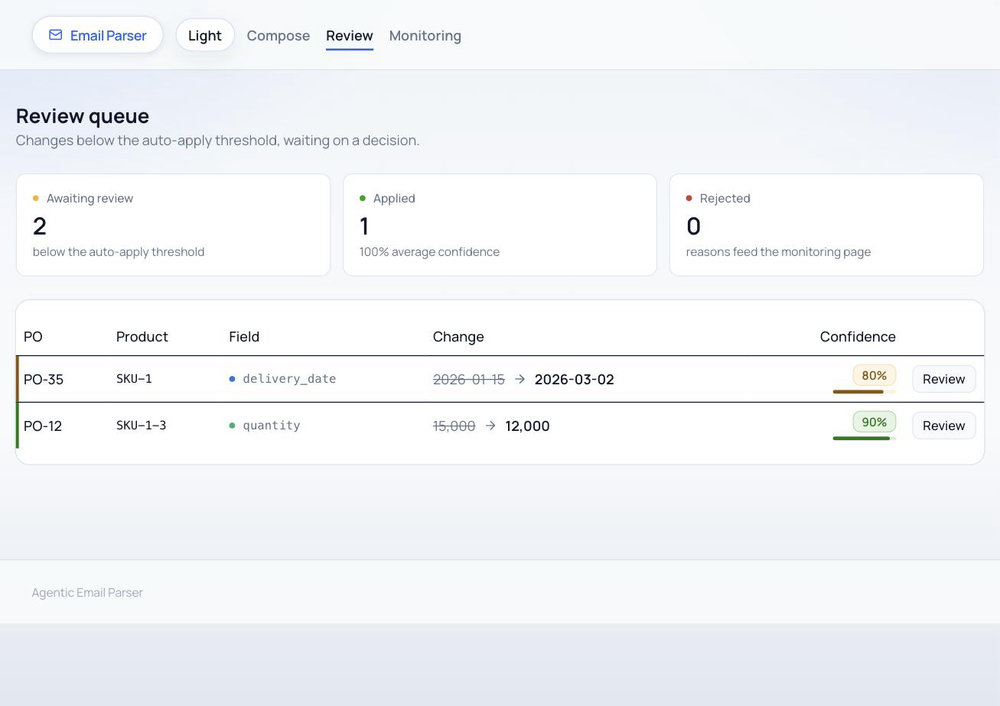

# Agentic Email Parser

**Which supplier emails changed a purchase order — and which of those changes is safe to apply without a human?**

Suppliers send purchase order updates as prose: a revised delivery date here, a partial shipment there, written in their own product codes. This service ingests those emails, uses an LLM to extract the purchase order updates, matches them back to canonical database rows, and writes back only the changes it can justify — routing everything else to a human review queue. Every write to canonical data passes through a staged proposal, an optimistic lock, and an immutable audit entry.



---

## What it is

A FastAPI backend and a React front end over PostgreSQL.

| Stage         | Where                  | What it does                                                                                                                                                            |
| ------------- | ---------------------- | ----------------------------------------------------------------------------------------------------------------------------------------------------------------------- |
| **Ingest**    | `backend/ingest.py`    | Parses RFC 822, stores the email and its attachments. Idempotent on a SHA-256 of the raw bytes.                                                                         |
| **Extract**   | `backend/extract.py`   | Builds a prompt from the supplier's open POs, their product-code aliases and their past corrections; calls the model; validates the response against a Pydantic schema. |
| **Match**     | `backend/match.py`     | Resolves the quoted PO reference and product code to real rows, scores how cleanly each resolved, and stages one `proposed_changes` row per field change.               |
| **Route**     | `backend/match.py`     | At or above the confidence threshold the change is applied immediately. Below it, a human decides.                                                                      |
| **Writeback** | `backend/writeback.py` | Applies an approved change under an optimistic lock, writing an audit row first.                                                                                        |
| **Review**    | `/review`              | The queue, with the proposed change and the original email side by side.                                                                                                |

```
supplier email
      │
      ▼
┌──────────┐   ┌──────────┐   ┌──────────┐
│  ingest  │──▶│ extract  │──▶│  match   │
│          │   │  (LLM)   │   │ PO + SKU │
└──────────┘   └──────────┘   └────┬─────┘
                                   │
                    combined_confidence ≥ 0.95 ?
                       ┌───────────┴───────────┐
                      yes                      no
                       ▼                       ▼
                 ┌───────────┐          ┌─────────────┐
                 │ writeback │          │ review queue│
                 │ + audit   │◀─approve─│   /review   │
                 └───────────┘          └─────────────┘
```

All of it is one FastAPI application on one port, including the retry worker.

---

## The demo path

One command produces a populated review queue. No API key, no network call.

```bash
pnpm setup      # createdb, venv, pip install, migrations
pnpm seed       # canonical data + fixture emails through the real pipeline
pnpm api        # backend  → :8000
pnpm dev        # frontend → :3000
```

`pnpm seed` prints exactly this, every time, on every machine:

```
  ✓ 01-delivery-confirmation.eml  proposed=1  auto-applied=1  pending=0
  ✓ 02-partial-shipment.eml       proposed=1  auto-applied=0  pending=1
  ✓ 03-provisional-schedule.eml   proposed=1  auto-applied=0  pending=1
  3 changes proposed, 1 auto-applied, 2 awaiting review.
```

### Follow it through with real values

**`01-delivery-confirmation.eml`** — Big Supplier writes _"Delivery for SKU-2 is now confirmed for 3 February 2026."_

The model returns `SKU-2 / delivery_date / 2026-02-03` at confidence `1.0`. `PO-12` matches a purchase order reference exactly (`1.0`); `SKU-2` matches a product SKU on that order exactly (`1.0`). Combined: `1.0 × 1.0 × 1.0 = 1.00`, at or above the `0.95` threshold, so it is **applied without a human**. Check it:

```sql
SELECT prior_value, new_value, applied_by FROM audit_log;
--  2026-01-15 | 2026-02-03 | auto
```

**`02-partial-shipment.eml`** — the same supplier writes _"On SKU13 we can only ship 12000 units this quarter rather than the full 15000."_

`SKU13` is not one of our SKUs. It is this supplier's own code for `SKU-1-3`, recorded in `supplier_product`, so it resolves — but through an alias, which scores `0.9` rather than `1.0`. Combined: `1.0 × 1.0 × 0.9 = 0.90`. Below threshold, so it lands in the queue at **90%**. Open it at http://localhost:3000/review and the evidence sentence is quoted beside the original email.

**`03-provisional-schedule.eml`** — Small Supplier writes _"we expect SKU-1 to ship sometime in early March."_

Nothing is misresolved here: `PO-35` and `SKU-1` both match exactly. The uncertainty is in the reading — the prompt tells the model to score hedged wording at `0.8`. Combined: `0.8 × 1.0 × 1.0 = 0.80`. It lands in the queue at **80%**.

So the queue holds two changes for two different reasons: one the system matched loosely, one the model read loosely. That distinction is why the score is a product of two numbers rather than one.

Approve the 90% change and the value moves; reject it and you must pick a reason, which is aggregated per supplier at `/monitoring`.

### Running it against a real model

The demo runs on a deterministic offline stub. To use OpenRouter instead:

```bash
LLM_PROVIDER=openrouter OPENROUTER_API_KEY=sk-... pnpm api
```

Then send an email from the compose page at http://localhost:3000. Live extraction is fully supported; it is just not on the demo path, so a reviewer never needs a key and a demo never depends on a network round trip.

Providers can also be chained, so a dead key or a rate limit degrades instead of failing the email:

```bash
LLM_PROVIDER=openrouter LLM_FALLBACK=ollama,stub pnpm api
```

`MODEL_NAME` defaults to `nvidia/nemotron-3-super-120b-a12b:free`, which costs nothing to call, so any OpenRouter key works without credit. Expect 15–60s per extraction — fine for a queue, slow for a live demo, which is why the demo path uses the stub. Swap in a frontier model for production.

Ollama speaks the same OpenAI-compatible API, so a local model needs no extra client — `ollama serve` and `ollama pull llama3.1`. Each run records the provider that actually answered (`openrouter:anthropic/claude-sonnet-4`, `ollama:llama3.1`, `offline-stub`), so the audit trail never claims a model that did not produce the output.

Only _availability_ failures fall through the chain. Output that comes back but fails schema validation is recorded as a failed run rather than retried elsewhere — that is a prompt problem, and a second opinion would hide it.

---

## Design decisions

**Why a confidence threshold at all.** Extraction is probabilistic and the database is not. Without a threshold the only two options are applying everything the model says — which corrupts canonical data the first time it misreads a date — or reviewing everything, which is just manual data entry with extra steps. The threshold converts a continuous belief into a binary decision and makes the trade-off explicit and tunable.

**Why the score is a product of two numbers.** `combined_confidence = extraction_confidence × match_confidence`. These fail independently: the model can read a sentence perfectly and still have its SKU resolved through a fuzzy alias, or resolve everything exactly while guessing at "early March". Multiplying means either kind of doubt pulls the change out of the automatic path. With the prompt emitting only `1.0`, `0.8` or `0.6`, a `0.95` threshold means auto-apply requires an unambiguous statement, an exact PO reference _and_ an exact SKU — any inference or alias hop routes to a human.

**Why low confidence goes to a person rather than being dropped or applied.** A missed delivery-date change is a stockout; a wrongly applied one is a phantom commitment nobody notices until the goods do not arrive. Both failures are expensive and neither is detectable downstream, because canonical data carries no signal about how it got there. A human sees the proposed change beside the sentence that produced it and decides in a few seconds. Rejections are recorded with a structured reason, so the failure modes aggregate into something a developer can act on.

**Why writeback uses optimistic locking.** A proposal is created at one moment and applied at another — possibly minutes later, possibly after a second email about the same line. `proposed_changes.target_record_version` records the canonical row's version at extraction time; the trigger on the canonical table increments it on every write. If the versions no longer agree, the row moved on since a human looked at it, the proposal is marked `superseded`, and **nothing is written**. Without it, approving two stale proposals in the wrong order silently produces last-write-wins. Both rows are taken `FOR UPDATE` so concurrent applies queue rather than race.

**What the audit log records.** One immutable row per canonical write: the table, the row, the field, the value before, the value after, who applied it (`auto` for threshold applies, otherwise the reviewer), and the `proposed_change_id` that authorised it. That last column is what makes it useful — from any changed value you can reach the proposal, the extraction run that produced it, the raw model output, and the original email. `UPDATE` and `DELETE` triggers raise, so history cannot be rewritten; reversing a change means running a new proposal through the same path.

---

## Setup

**Requires** PostgreSQL 15+, Python 3.12+, Node 20+ and pnpm.

```bash
pnpm install
cp .env.example .env          # defaults work as-is
createdb email_parser
pnpm migrate                  # applies migrations/*.sql in order
pnpm seed                     # canonical data + fixture emails
```

`pnpm setup` does all of the above in one step, including creating the Python virtualenv.

| Command        | What it does                              |
| -------------- | ----------------------------------------- |
| `pnpm api`     | The backend — FastAPI, uvicorn, port 8000 |
| `pnpm dev`     | The frontend — Vite, port 3000            |
| `pnpm migrate` | Applies every SQL migration in order      |
| `pnpm seed`    | Resets to the demo state (destructive)    |
| `pnpm build`   | Production build                          |
| `pnpm test`    | Backend test suite (pytest)               |

Every environment variable is documented in `.env.example`. Implementation detail, the stack rationale and the known gotchas live in [DESIGN.md](DESIGN.md); the schema and the concurrency check are in [migrations/README.md](migrations/README.md).

### Tests

```bash
pnpm test
```

154 tests against a real PostgreSQL database, created and migrated per run. They cover extraction output validation and the invalid-output path, confidence scoring, the auto-apply versus review routing decision, writeback under concurrent update, provider fallback, attachment parsing, the alias-learning flows, the retry worker's discovery query, the HTTP surface, and the demo path itself. No test asserts anything about the model — every response comes from the offline stub, and the suite pins the stub so a run can never make a network call.

---

## Known limitations

- **The fallback chain is not a circuit breaker.** Every email retries the dead provider first and waits for it to fail. Fine at this volume; at scale it wants a breaker that skips a provider known to be down.
- **No auth.** Every endpoint is open and `reviewer_id` is whatever the client sends. Fine for a single-operator tool, not for multi-tenant use.
- **`normalize_ref` collapses zero runs anywhere, not just leading ones.** `PO-10`, `PO-010`, `PO-100` and `PO-1000` all normalise to `10`, and `PO-12` collides with `PO-102`. Contained rather than fixed: a fuzzy PO hit caps combined confidence at 0.9, so a mis-resolved reference always lands in review instead of being written back. Not reachable with the current dataset.
- **Model output that is not JSON at all is recorded as a successful, empty extraction.** `{}` is valid against the schema because every top-level field has a default, so a refusal reads as "no PO updates found" rather than as an error, and is never retried. Schema _violations_ are handled properly — stored as a failed run with the message.
- **`AUTO_APPLY_THRESHOLD=0` does not disable auto-apply.** The comparison is `>=`, so `0` matches everything and empties the review queue. Use a value above `1.0` to send everything to a human.
- **Attachment parity is approximate.** `openpyxl` cannot read legacy `.xls`, and `pypdf` will not extract text identically to the previous JavaScript implementation on complex layouts. Neither is on the demo path.
- **The retry worker is single-process.** It polls inside the API process with no leader election, so running two API instances would double-process stuck emails.
- **Only two fields are writable** — `delivery_date` and `quantity` on `purchase_order_line`. The whitelist in `backend/writeback.py` is deliberate; widening it means deciding how each new column is cast and validated.
- **`evidence_metadata`, `reviewer_id` and `review_notes` are modelled but barely used.** Page and character offsets would let the UI highlight evidence inside the email rather than quoting it separately.
